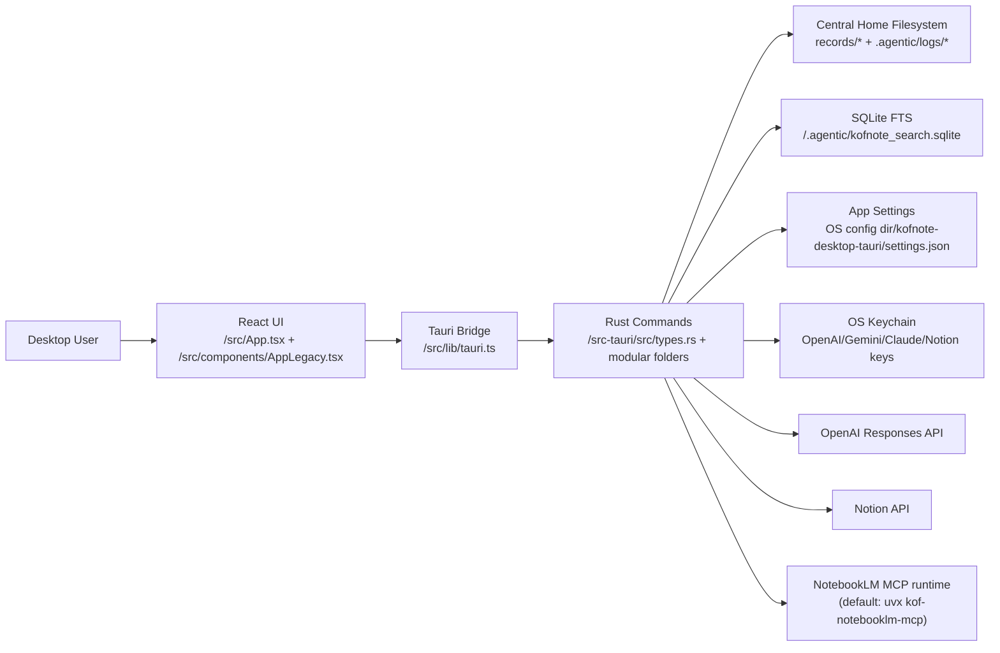
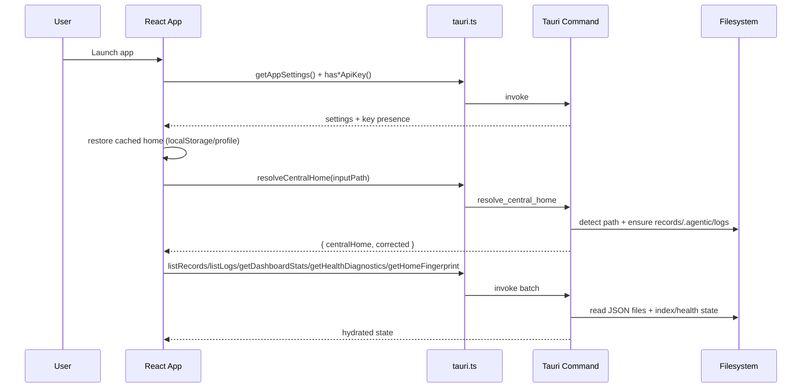
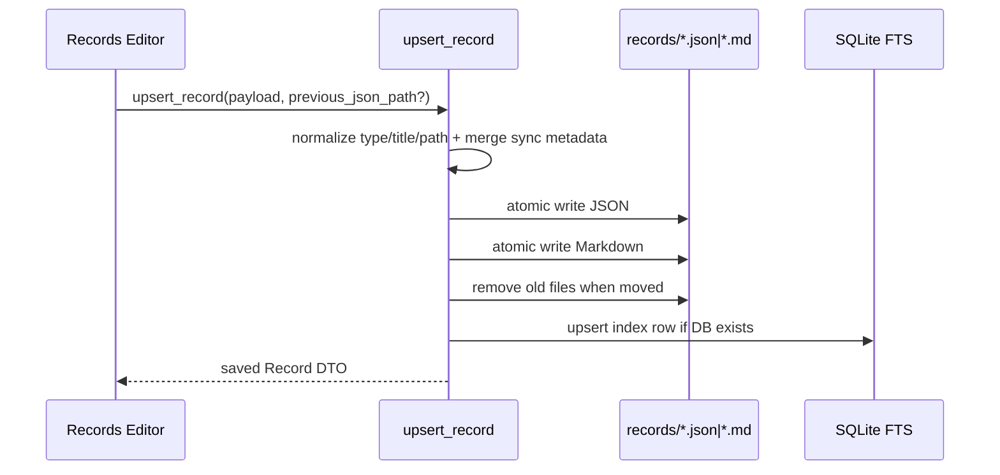
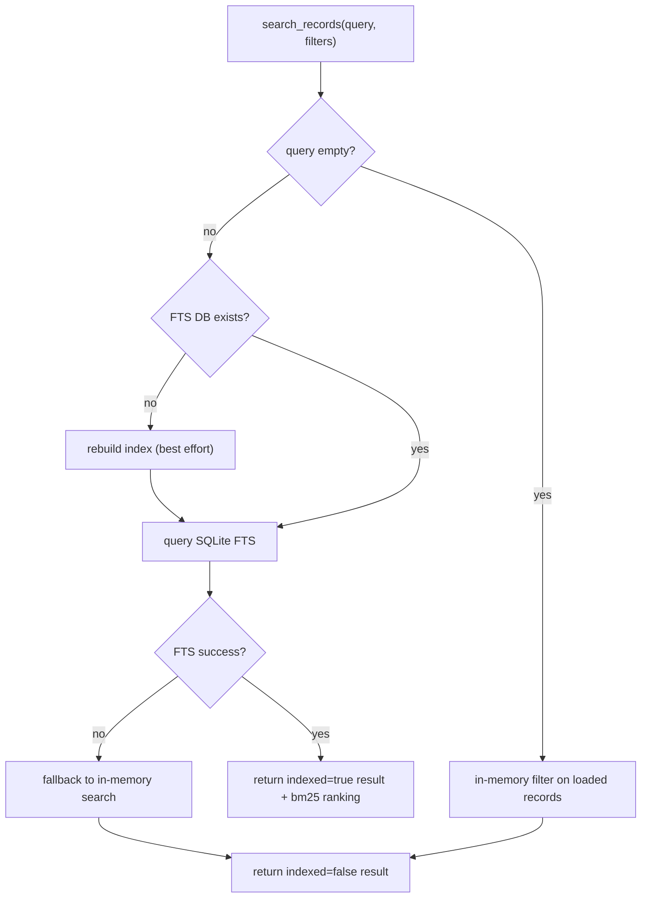
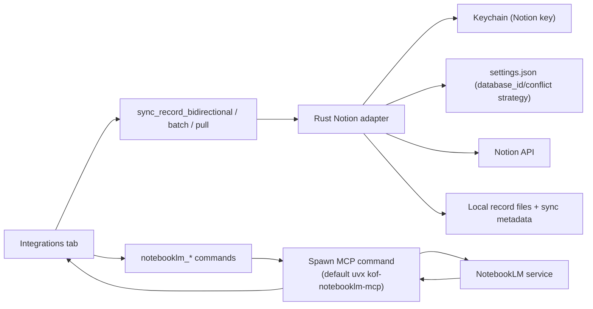

# KOF Note Architecture

Updated: 2026-02-09

## 1. Purpose and Scope (What / Why)

### What
KOF Note is a desktop console for a `keeponfirst-local-brain` central log workspace.  
It provides:

- Central Home discovery and normalization.
- Record CRUD for `decision/worklog/idea/backlog/note`.
- Dashboard visualization (KPIs, distributions, activity wave, interactive force graph).
- Search and indexing (SQLite FTS5).
- Integrations (Notion bidirectional sync, NotebookLM MCP bridge).
- AI analysis (local heuristic + OpenAI provider).

### Why
The goal is to give one local-first command center for knowledge capture, operational logs, and action-oriented analysis while keeping compatibility with the existing on-disk structure.

## 2. High-Level Architecture

### Runtime split

- `kofnote-app/`: primary production runtime (Tauri + React + TypeScript + Rust).
- root Python app (`main.py` + `kofnote_desktop/`): legacy MVP runtime kept for compatibility.

### Layered architecture (primary runtime)



### Module boundaries

- Presentation/UI: `kofnote-app/src/App.tsx` (entry), `kofnote-app/src/components/AppLegacy.tsx`, `kofnote-app/src/index.css`.
- Frontend gateway: `kofnote-app/src/lib/tauri.ts` (typed wrapper + mock runtime).
- Domain/infra backend: `kofnote-app/src-tauri/src/main.rs` (startup wiring) + `kofnote-app/src-tauri/src/types.rs` (runtime logic) + modular folders under `commands/`, `providers/`, `storage/`.
- Shared contracts: `kofnote-app/src/types.ts`.
- i18n layer: `kofnote-app/src/i18n/*` (currently `en`, `zh-TW`).

## 3. Repository Structure and Responsibilities

```text
/
├── README.md                         # legacy-root usage + links
├── plan.md                           # implementation milestones/history
├── main.py                           # legacy Python app entrypoint
├── kofnote_desktop/                  # legacy Tkinter implementation
│   ├── app.py
│   ├── repository.py
│   ├── analytics.py
│   ├── ai.py
│   └── models.py
├── tests/                            # legacy Python unit tests
│   ├── test_repository.py
│   └── test_analytics.py
├── kofnote-app/                      # main production desktop app
│   ├── src/
│   │   ├── App.tsx                   # thin app entrypoint
│   │   ├── components/AppLegacy.tsx  # current full UI orchestration
│   │   ├── components/*Tab.tsx       # planned tab extraction targets
│   │   ├── hooks/useNotices.ts       # notice hook scaffold
│   │   ├── constants.ts              # frontend constants scaffold
│   │   ├── lib/tauri.ts              # invoke wrappers + mock runtime
│   │   ├── i18n/                     # translation dictionaries
│   │   └── types.ts                  # TS DTOs
│   ├── src-tauri/
│   │   ├── src/main.rs               # Tauri startup wiring
│   │   ├── src/types.rs              # runtime logic + command implementations
│   │   ├── src/commands/             # command module namespace (scaffold)
│   │   ├── src/providers/            # provider module namespace (scaffold)
│   │   └── src/storage/              # storage module namespace (scaffold)
│   │   ├── tauri.conf.json           # Tauri app/runtime config
│   │   └── Cargo.toml                # Rust deps/features
│   ├── e2e/smoke.spec.ts             # Playwright e2e smoke
│   ├── playwright.config.ts
│   └── package.json
├── openspec/                         # OpenSpec SSOT structure
│   ├── config.yaml
│   ├── specs/
│   └── changes/
└── docs/
    ├── ARCHITECTURE.md
    └── SDD_WITH_OPENSPEC.md
```

## 4. Key Flows

### 4.1 Startup + Central Home load



### 4.2 Record upsert + markdown + index maintenance



### 4.3 Search flow (FTS first, memory fallback)



### 4.4 Notion + NotebookLM integration flow



## 5. Important Configuration and Environment Variables

### Runtime data/config locations

- Central workspace data:
  - `records/{decisions,worklogs,ideas,backlogs,other}/*.json|*.md`
  - `.agentic/logs/*.json`
- Tauri app settings: OS config dir + `kofnote-desktop-tauri/settings.json`.
- Search index: `<central_home>/.agentic/kofnote_search.sqlite`.
- Legacy Python config: `~/.kofnote-desktop/config.json`.
- API keys (Tauri): OS Keychain entries under service `com.keeponfirst.kofnote`.

### Environment variables and flags

| Name | Used by | Purpose |
| --- | --- | --- |
| `OPENAI_API_KEY` | legacy Python app | Fallback for OpenAI analysis if key not entered in UI |
| `ANTIGRAVITY_LOG_HOME` | legacy Python app | Default Central Home |
| `VITE_KOF_MOCK=1` | React/Tauri bridge | Force mock runtime (no native Tauri backend) |
| `CI=true` | build scripts / Playwright | CI behavior (`tauri build --debug`, server reuse toggle) |
| `PATH=...rustup...` | npm scripts | Ensure `cargo` is discoverable for Tauri commands |
| `OPENSPEC_TELEMETRY=0` | OpenSpec CLI | Optional telemetry opt-out |

## 6. Local Development / Test / Build / Deploy

### Legacy Python MVP (still runnable)

```bash
cd /Users/pershing/Documents/henry/Fun/kofnote
python3 main.py
python3 -m unittest discover -s tests -p 'test_*.py'
```

### Main desktop app (Tauri + React)

```bash
cd /Users/pershing/Documents/henry/Fun/kofnote/kofnote-app
npm install
npm run tauri:dev
```

Useful verification commands:

```bash
cd /Users/pershing/Documents/henry/Fun/kofnote/kofnote-app
npm run lint
npm run build
npm run test:e2e
```

Build/package desktop app:

```bash
cd /Users/pershing/Documents/henry/Fun/kofnote/kofnote-app
npm run tauri:build
```

Notes:

- When `cargo` is not on shell `PATH`, use the existing scripts in `package.json` (they prepend rustup toolchain path).
- Current repository has no explicit CI pipeline file; build/test are run manually or through local task runners.

## 7. Known Technical Debt / Risks (from current state)

1. **Large monolithic modules**
   - Runtime monolith risk still exists in `kofnote-app/src/components/AppLegacy.tsx` and `kofnote-app/src-tauri/src/types.rs`; extraction scaffolds are in place but decomposition is still ongoing.

2. **Dual runtime maintenance cost**
   - Legacy Python app and Tauri app coexist, with overlapping capabilities and duplicated logic.

3. **Test coverage gap on real backend**
   - Playwright e2e runs primarily against mock runtime (`VITE_KOF_MOCK=1`), so native Tauri command regressions may escape.

4. **Provider surface mismatch**
   - Key management supports OpenAI/Gemini/Claude, but `run_ai_analysis` currently handles only `local` + `openai`.

5. **Integration reliability dependency**
   - NotebookLM depends on an external MCP command (`uvx kof-notebooklm-mcp`) and authenticated runtime availability; failures are runtime/environment-sensitive.

6. **On-disk schema coupling**
   - App behavior depends on implicit folder + JSON field conventions. Schema drift from external writers can degrade parsing/sync behavior.
